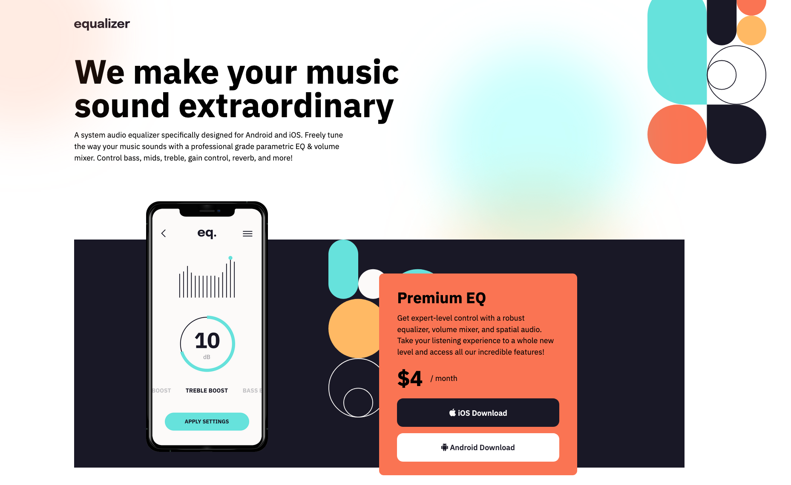

# 01-Equalizer-Landing-Page

Equalizer Landing Page

- used clamp a lot on this project to make it repsonsive from desktop to tablet without media queries.
- when using background images it is mandatory to put a width and height on the container div
- if you have multiple transforms they need to be on one line or else the one below will overwrite the above.
- to deal with overflow due to negative positions on absolute elements overflox-x needs to be on the HTML element as well as the body element.
- change to fix bug on github pages

